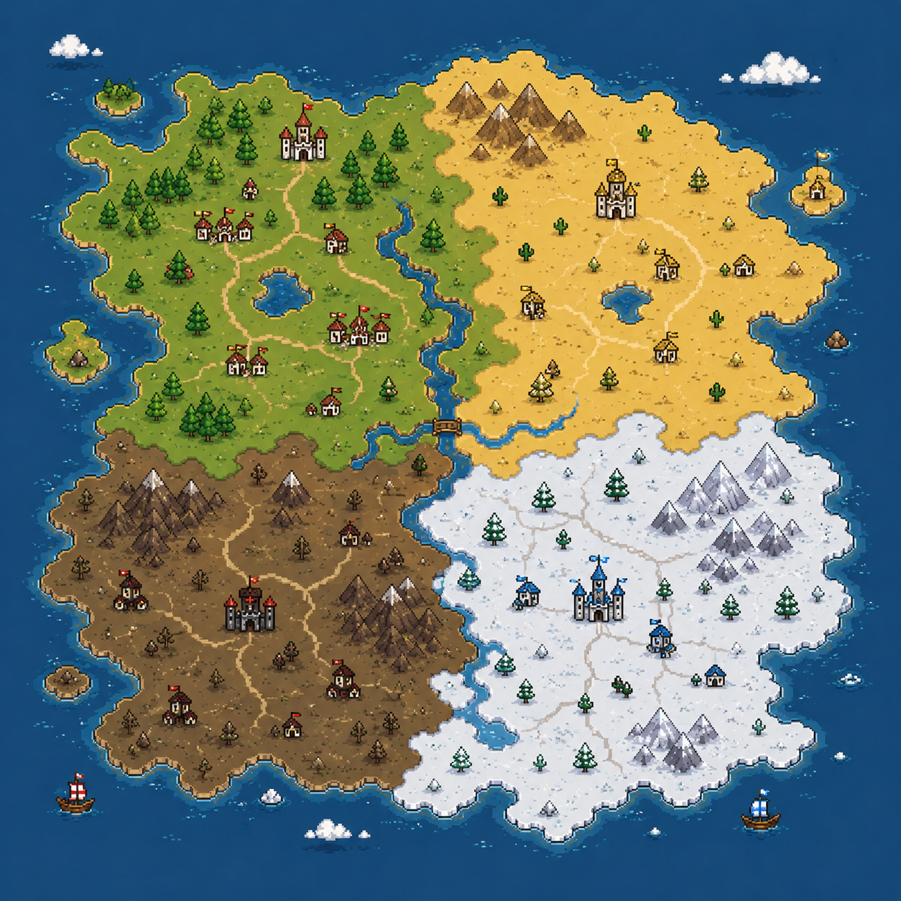

# Jac Civilization God Mode

Jac Civilization God Mode is a living civilization sandbox powered by Jac. Five factions share a pixel-art world map, react to disasters, form alliances, trade, fight wars, migrate, collapse, and explain their decisions as the simulation runs.

This is not a static dashboard. The map moves, routes update, units march, disasters spread, population changes, and Jac agent traces show why each civilization chose its next action.

> **Hosted demo note:** The public Render deployment may take a few seconds to respond to the first command. The backend runs the live simulation and Jac decision pass on demand, and free hosted instances can briefly cold start after inactivity. After the service wakes up, commands process normally.

## Live Demo

Open the deployed version here:

```text
https://jac-civilization.onrender.com/
```

## Hackathon Judge Notes: Where Jac Is Used

Jac is not just mentioned in the branding. It is part of the live decision loop.

The core Jac file is:

```text
backend/simulation.jac
```

That file contains the agentic strategy logic for civilizations and agents. It evaluates live world state and returns structured decisions with explanations.

The Python bridge is:

```text
backend/app/jac_engine.py
```

FastAPI calls this bridge during simulation ticks, event reactions, and command execution. The bridge runs the Jac program and returns decisions to the Python simulation layer.

The world-state application layer is:

```text
backend/app/simulation.py
```

This file applies Jac decisions to the actual world. For example, when Jac chooses `attack`, `ally`, `trade`, `fortify`, `migrate`, `recover`, `research`, or `declare_ceasefire`, the backend updates population, stability, relationships, routes, memory, and active orders.

The visible proof in the UI is the **Jac Agent Trace** panel. It shows:

- the Jac walker name
- the civilization being evaluated
- input values such as population, stability, deaths, recent deaths, nearby enemy, threat level, and active events
- the decision returned by Jac
- the human-readable reason for that decision

In short:

```text
User command or world event
  -> FastAPI backend
  -> backend/simulation.jac
  -> Jac decision returned
  -> Python updates world state
  -> React displays map changes and Jac trace
```

## Visual Preview

### Living World Map



### Civilization Leaders

<p>
  
  
</p>

### Pixel Unit Assets

<p>
  
  
  
</p>

## What You Can Do

- Trigger world events like war, plague, meteor strikes, resource booms, climate collapse, alien contact, AI uprising, religion, and nuclear strikes.
- Type natural commands such as `Varku attack Khepri`, `Khepri ally Solarians`, or `give Solarians tech boost`.
- Watch red war arrows, green alliance/trade lines, moving order circles, disaster rings, refugee movement, and faction units.
- Select a civilization and inspect population, stability, kills, deaths, technology, memory, and current strategy.
- Read the live Jac Agent Trace to see the walker, inputs, decision, and reasoning behind civilization behavior.

## How Jac Is Used

Jac is the decision engine for the simulation.

`backend/simulation.jac` evaluates each civilization's state, including:

- population
- stability
- deaths and recent losses
- nearby enemies
- active disasters
- trade routes
- faction traits
- world pressure

Jac returns decisions such as:

- attack
- ally
- trade
- fortify
- migrate
- recover
- research
- adapt
- declare ceasefire

FastAPI calls the Jac engine, applies the decision to the world state, and React visualizes the result.

## Architecture

```text
React frontend
  -> FastAPI backend
  -> Jac agent engine
  -> civilization decisions
  -> world state update
  -> live map visualization
```

## Factions

- Solarians: technological empire focused on invention.
- Varku: militaristic faction built around conquest.
- Elyrians: diplomatic kingdom that prefers treaties.
- Nomads: adaptive migrants who survive through movement.
- Khepri: religious civilization guided by faith and memory.

## Map Legend

- Red arrow: active war or invasion.
- Green line: alliance or trade route.
- Gold dashed line: diplomatic tension.
- Moving circle: order progress.
- Pulsing circle: disaster or crisis zone.

## Example Commands

```text
Varku attack Khepri
Khepri ally Solarians
Solarians trade with Khepri
plague Varku
meteor desert
nuclear strike Khepri
ceasefire Varku Khepri
make Khepri migrate north
give Solarians tech boost
```

## Run Locally

Install backend dependencies:

```powershell
cd D:\Games\CIVILIZATION
pip install -r backend\requirements.txt
```

Start the backend:

```powershell
$env:PYTHONPATH="D:\Games\CIVILIZATION\backend"
uvicorn app.main:app --app-dir backend --reload --host 127.0.0.1 --port 8001
```

Install frontend dependencies:

```powershell
cd D:\Games\CIVILIZATION\frontend
npm install
```

Start the frontend:

```powershell
npm run dev
```

Open:

```text
http://127.0.0.1:5173
```

## Verification

```powershell
cd D:\Games\CIVILIZATION
$env:PYTHONPATH="D:\Games\CIVILIZATION\backend"
python -m jaclang check --parse_only backend\simulation.jac
python -m pytest backend\tests -q
cd frontend
npm run build
```

## Project Structure

```text
backend/
  app/
    jac_engine.py      # Python bridge that calls Jac
    main.py            # FastAPI routes
    simulation.py      # world-state application layer
  simulation.jac       # agentic civilization decision logic
  tests/

frontend/
  src/
    App.jsx
    components/
    styles.css
  public/assets/
```

## Why It Matters

The interesting part is not just that disasters happen. It is that civilizations remember, reason, and respond differently. A plague may make one faction research, another migrate, another fortify, and another attack for medicine. The frontend shows the story, but Jac is where the strategic decisions are made.
